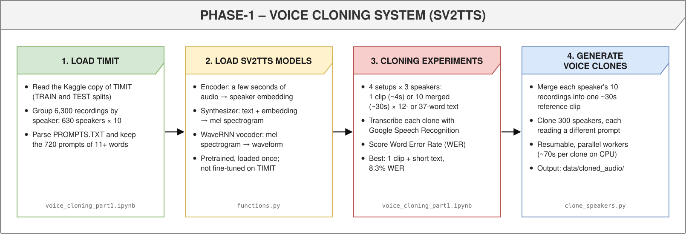
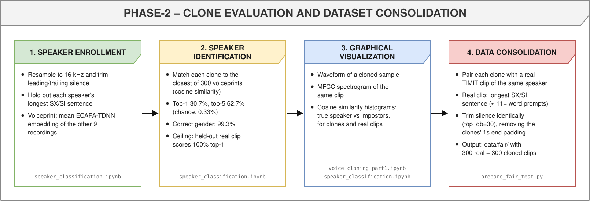
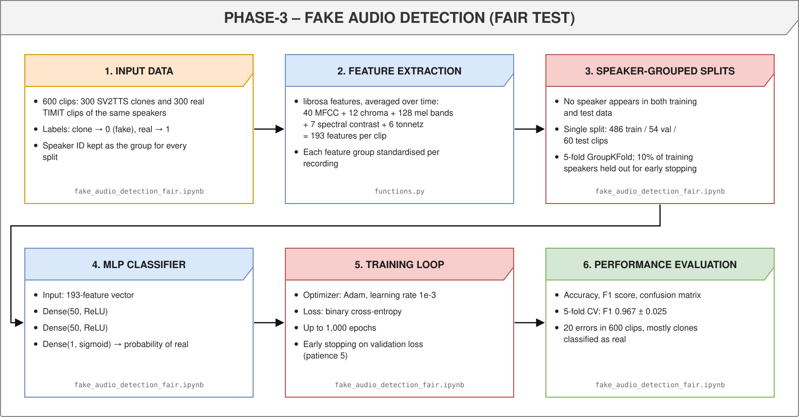
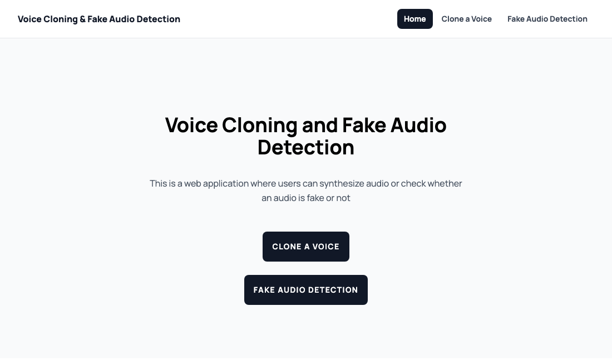
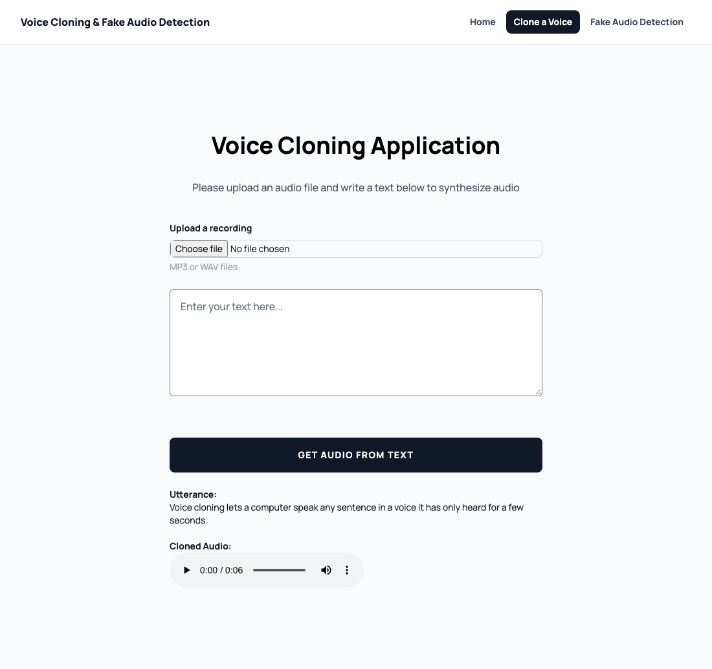
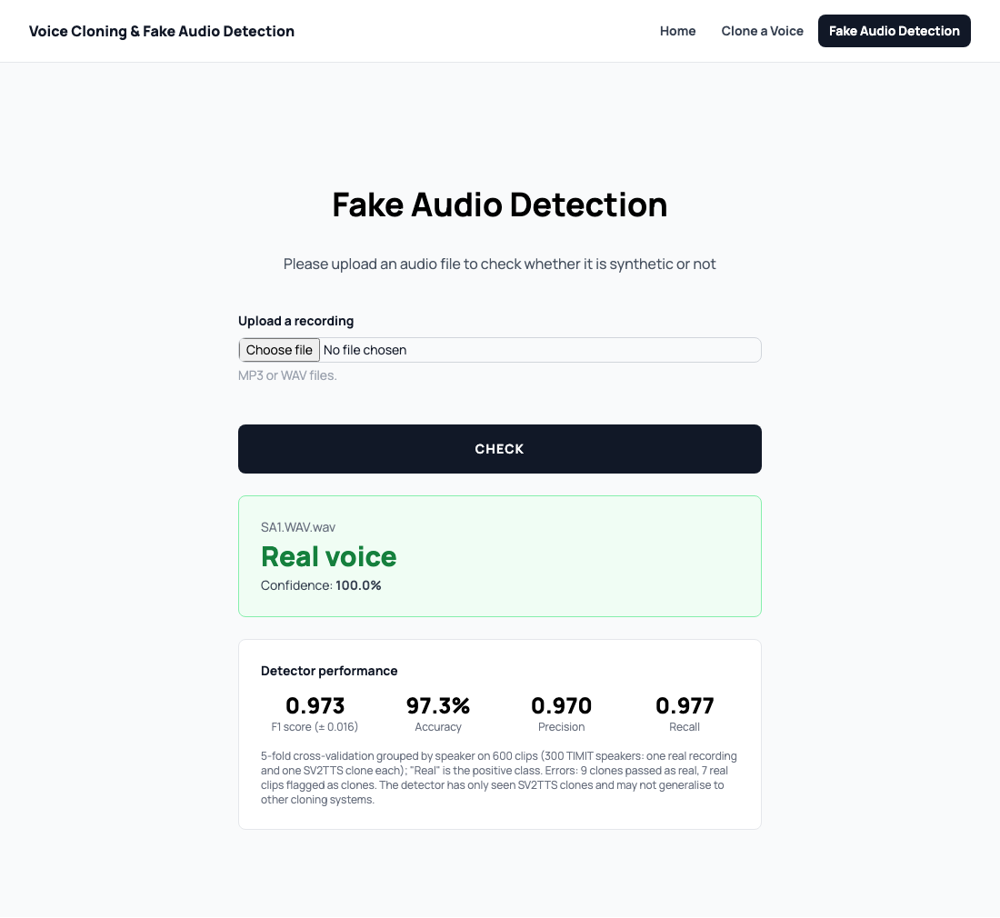
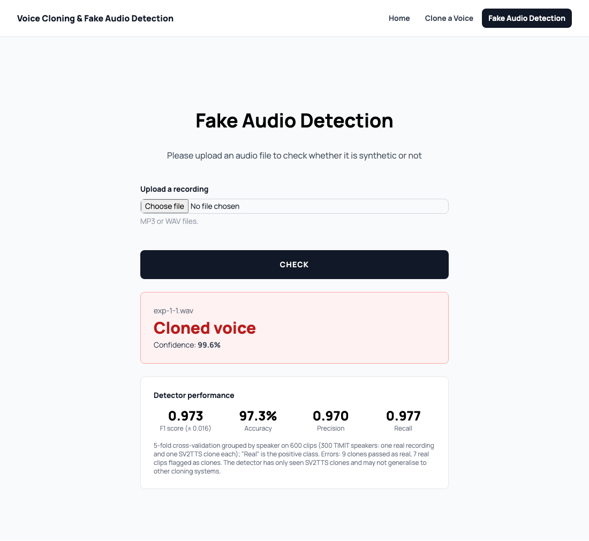

# Voice Cloning and Fake Audio Detection

A system that clones a speaker's voice from a few seconds of their speech, then trains a classifier to tell natural speech from cloned speech.

**Author:** samuelmugisha ([dcgroup205@gmail.com](mailto:dcgroup205@gmail.com))

## Data

- [**TIMIT**](https://github.com/philipperemy/timit): 6,300 read sentences, 10 from each of 630 US English speakers across 8 dialect regions. Used as the source voices and prompts for cloning, and as matched real speech in the fair detection test.
- [**LibriSpeech dev-clean**](https://www.openslr.org/12): read audiobook speech. Used as the real class when reproducing the detection experiment.

## Success metrics

- **Voice cloning:** Word Error Rate (WER) of the cloned speech, measured by transcribing it with Google Speech Recognition, and **speaker classification accuracy**: how often an independent speaker recognition model attributes a clone to the speaker it was cloned from.
- **Fake audio detection:** F-score, with real recordings as positives and clones generated by the voice cloning system as negatives.

## Approach

The project runs in three phases: clone TIMIT voices, check how well the clones match their speakers and build a matched real-vs-cloned dataset, then train a detector on that dataset. Each box in the diagrams below names the file that implements that step.

### Voice cloning



Voice cloning uses [SV2TTS](https://arxiv.org/abs/1806.04558) (Transfer Learning from Speaker Verification to Multispeaker Text-To-Speech Synthesis), via the [Real-Time-Voice-Cloning](https://github.com/CorentinJ/Real-Time-Voice-Cloning) implementation bundled in `WebApp/`:

- **Encoder:** turns a few seconds of a speaker's audio into a speaker embedding.
- **Synthesizer:** generates a mel spectrogram for any text, conditioned on that embedding.
- **Vocoder (WaveRNN):** converts the spectrogram into a waveform.

The three models are used **pretrained**. The encoder was trained on LibriSpeech and VoxCeleb, and the synthesizer and vocoder on LibriSpeech. They were not trained or fine-tuned on TIMIT. TIMIT supplies the reference voices and the sentences to speak.

Four setups were compared, each on 3 speakers:

| Setup | Reference audio | Text | WER |
| --- | --- | --- | --- |
| 1.1 | One TIMIT sentence (~4s) | Short (12 words) | **8.3%** |
| 1.2 | One TIMIT sentence | Long (37 words) | 25.2% |
| 2.1 | All 10 of the speaker's sentences merged (~30s) | Short | 16.7% |
| 2.2 | All 10 sentences merged | Long | 55.0% |

The WER scoring doesn't strip punctuation, so 8.3% on the 12-word text is one "error" caused by a comma: the transcription in 1.1 was otherwise word-perfect. Long texts are cloned much less reliably. The cloned speech tends to drift off partway through. Setup 2.1 was used to generate the detection dataset. These results don't show 2.1 beating 1.1, but with 3 clips per setup the differences are within noise.

Using setup 2.1, 300 TIMIT speakers were cloned, each reading a different TIMIT prompt of 11+ words (`clone_speakers.py`).

### Speaker classification accuracy



Each of the 300 clones is compared against voiceprints of all 300 real speakers. A voiceprint is the average embedding of 9 of the speaker's real recordings. The clone counts as correct if its closest voiceprint is the speaker it was cloned from. The judge is **ECAPA-TDNN** (SpeechBrain, trained on VoxCeleb), which is independent of the cloning system. Chance is 1/300 = 0.33%.

| Test audio | Top-1 accuracy | Top-5 accuracy | Gender correct | Cosine similarity to true speaker |
| --- | --- | --- | --- | --- |
| **Clones** | **30.7%** | **62.7%** | **99.3%** | 0.35 |
| Real held-out recording (ceiling) | 100% | 100% | 100% | 0.85 |

The clones are attributed to the correct speaker 92× more often than chance and almost always to the correct gender. Their similarity to the true speaker (0.35) is far below that of a genuine recording (0.85), though. The clones capture gender and general voice character, not an individual's voice. Scoring with the SV2TTS encoder instead gives 51.0% top-1, but that encoder is what conditioned the cloning, so it grades its own output. The independent figure is the one to cite.

### Fake audio detection



Each recording is summarised by 193 features, averaged over time: 40 MFCCs, 12 chroma, 128 mel bands, 7 spectral contrast and 6 tonnetz. Each feature group is standardised per recording. A small neural network (two dense layers of 50 units, sigmoid output) is trained with early stopping on validation loss.

| Experiment | Real audio | Fake audio | Result |
| --- | --- | --- | --- |
| Reproduction (`fake_audio_detection_part2.ipynb`) | 300 LibriSpeech clips | 300 SV2TTS clones | Test F1 1.00 (60 clips), validation accuracy 90.7% |
| **Fair test** (`fake_audio_detection_fair.ipynb`) | 300 TIMIT clips from the **same speakers** as the clones | 300 SV2TTS clones | **F1 0.967 ± 0.025** (5-fold cross-validation, 20 errors in 600) |

The near-perfect score in the first row overstates the detector. The classifier can separate the classes using shortcuts:
- Every clone ends with 1 second of silence added by the synthesis code.
- Real and fake audio come from different corpora and recording conditions.
- The splits aren't grouped by speaker.

The fair test removes these shortcuts:
- Real and cloned audio come from the same 300 speakers and the same corpus.
- Silence is trimmed identically from both classes.
- Every split is grouped by speaker, so no test voice is seen in training.
- 5-fold cross-validation replaces a single 60-clip test set.

The detector still reaches an F1 of about 0.97. Its mistakes are mostly clones passed off as real.

## Limitations

- The pretrained models weren't adapted to TIMIT, and speaker similarity of the clones is modest (see above).
- The detector is trained and tested on clones from a single system (SV2TTS). It may not generalise to other voice cloning or TTS systems.
- In the fair test, real and cloned clips contain different sentences. The features are averaged over time, so this should have little effect.
- WER is based on 3 clips per setup and depends on Google's speech recognition service.

## Repository contents

| File | Purpose |
| --- | --- |
| `voice_cloning_part1.ipynb` | Voice cloning experiments and WER |
| `speaker_classification.ipynb` | Speaker classification accuracy of the clones |
| `fake_audio_detection_part2.ipynb` | Detection experiment reproduced with clones vs LibriSpeech |
| `fake_audio_detection_fair.ipynb` | Fair detection test with speaker-matched data and grouped cross-validation |
| `functions.py` | Cloning, WER, feature extraction and evaluation helpers |
| `clone_speakers.py` | Batch-clones TIMIT speakers (resumable, can run as parallel workers) |
| `prepare_part2_data.py` | Builds the LibriSpeech real clips for the Part 2 detection experiment |
| `prepare_fair_test.py` | Builds the speaker-matched dataset for the fair test |
| `train_detector.py` | Trains the web app's detector on the fair dataset and saves its cross-validated scores |
| `WebApp/` | Flask app for cloning and detection, with the SV2TTS inference code and the trained detector |
| `images/` | Pipeline diagrams and web app screenshots used in this README |

The TIMIT recordings embedded in the notebooks' outputs have been removed, because TIMIT is licensed.

## Reproducing the results

1. **Environment** (Python 3.11):
   ```bash
   python3.11 -m venv .venv
   .venv/bin/pip install -r requirements.txt
   .venv/bin/python -m ipykernel install --user --name voice-cloning-venv
   ```
2. **Pretrained SV2TTS models:** download `encoder.pt`, `synthesizer.pt` and `vocoder.pt` from [huggingface.co/CorentinJ/SV2TTS](https://huggingface.co/CorentinJ/SV2TTS) into `WebApp/saved_models/default/`.
3. **TIMIT:** download the [Kaggle copy](https://www.kaggle.com/datasets/mfekadu/darpa-timit-acousticphonetic-continuous-speech). Put `TRAIN/` and `TEST/` under `TIMIT_orig/`, and the documentation files (`PROMPTS.TXT`, `train_data.csv`, `test_data.csv`, …) under `TIMIT_orig/DOC/`.
4. **Run, in order:**
   - `voice_cloning_part1.ipynb`: cloning experiments. The WER cells need internet access.
   - `python clone_speakers.py --n 300` to clone 300 speakers. This takes about 70 seconds per clone on a laptop CPU. Pass `--worker i --workers k` to run k processes in parallel.
   - `speaker_classification.ipynb`
   - `python prepare_fair_test.py`, then `fake_audio_detection_fair.ipynb`
   - `python train_detector.py` to train the web app's detector
   - For the LibriSpeech comparison: download and extract [dev-clean](https://www.openslr.org/12) to `.cache/LibriSpeech/dev-clean`, run `python prepare_part2_data.py`, then `fake_audio_detection_part2.ipynb`

## Web app

`WebApp/` contains a Flask app with three pages, linked by a navigation bar at the top of each page:

| Page | Address | What it does |
| --- | --- | --- |
| Home | http://localhost:5000/ | Links to the two tools |
| Clone a Voice | http://localhost:5000/voice_cloning | Upload a recording and type any text to hear it in that voice. Needs the pretrained SV2TTS models |
| Fake Audio Detection | http://localhost:5000/fake_audio_detection | Upload a recording to find out whether it's a real voice or a clone. Shows the prediction with its confidence, and the detector's F1 score, accuracy, precision and recall |

| Home | Clone a Voice |
| --- | --- |
|  |  |

The detector is the fair-test model, trained on all 300 speaker-matched pairs by `train_detector.py` (`WebApp/models/detector_fair.keras`). Uploads are trimmed of silence the same way as the training data. Its scores come from 5-fold speaker-grouped cross-validation: **F1 0.973 ± 0.016**, accuracy 97.3%, with 9 clones passed as real and 7 real clips flagged as clones out of 600.

| Real voice (a TIMIT recording) | Cloned voice (an SV2TTS clone) |
| --- | --- |
|  |  |

Run it from the project environment:
```bash
python train_detector.py          # needs data/fair from prepare_fair_test.py
cd WebApp
# for voice cloning, place the pretrained SV2TTS models in WebApp/saved_models/default/ (see above)
../.venv/bin/python -m flask --app app run
```
Then open http://localhost:5000 and use the navigation bar to move between pages. To use another port, add `--port 5050` and change the addresses above to match.

A `Dockerfile` is included, with its own `WebApp/requirements.txt`. Build it from `WebApp/` after placing the models:
```bash
docker build -t vcfad .
docker run -p 5000:5000 vcfad
```

## Acknowledgements

- SV2TTS implementation and pretrained models: [CorentinJ/Real-Time-Voice-Cloning](https://github.com/CorentinJ/Real-Time-Voice-Cloning)
- Speaker recognition model: [SpeechBrain ECAPA-TDNN](https://huggingface.co/speechbrain/spkrec-ecapa-voxceleb)
- This project builds on [sudarshanng7/Voice-Cloning-and-Fake-Audio-Detection](https://github.com/sudarshanng7/Voice-Cloning-and-Fake-Audio-Detection), which provided the original notebook, web app and detection experiments
